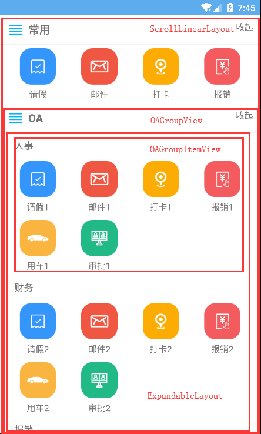

# 实现复杂的伸缩列表布局套件
* 轻松实现高效复杂的伸缩列表

# 引入
   项目build.grade:
    
   ```
    allprojects {
		repositories {
			...
			maven { url 'https://jitpack.io' }
		}
	}
   ```
   * LastVersion[1.2]
   <br>模块build.gradle:
   ```
    dependencies {
	        implementation 'com.github.dragonforestgroup:ExpandGroupListView:[lastVersion]'
	}
   ```

# 布局介绍
 * 以下布局均可单独使用
 
## ExpandableLayout: 可伸缩的布局
* * 感谢 https://github.com/cachapa/ExpandableLayout  
* 效果：<br>
   
   
## ExpandableSplitLayout: 可伸缩的带头部和内容的布局，自定义头布局和内容布局
* 效果：<br>
   
* API

|   ||
|---|---|
|  setHeadLayout(View) |设置头布局|
|  setContentView(View) |设置内容布局|
|  addContentView|添加内容布局，可添加多个，垂直排列|
|  clearContentViews()|清除所有内容布局|
|  showHead(Boolean)|是否显示头布局，默认显示|
|  getContentLayout()|获取内容布局，可对其进行设置|
|  getHeadLayout()|获取头布局，可对其进行设置|


## OAGroupLayout: 基于OA列表定制的伸缩列表布局
* 继承于ExpandableSplitLayout
* 效果：<br>
   
* API:拥有父类的所有api,以下是特有的api

|   ||
|---|---|
|  setData(List<OAGroup>) |设置数据集，包含多个OA列表集合|
|  setItemOnClickListener(OARecyclerViewItemClickListener) |设置子项监听事件|
|  showChildHead(booelan)|是否显示子项的标题|
|  setColumn(int)|设置显示的列表的列数|
|  setDividerHeight(int)|设置多个事务列表之间的间距|
|  getContentLayout()|获取内容布局，可对其进行设置|
|  getHeadLayout()|获取头布局，可对其进行设置|
|  getTv_oa_title()|获取头部标题控件，可对其显示进行设置|
|  getTv_expand()|获取头部伸缩标志控件，可对其显示进行设置|


* 使用：<br>
   ```
    // ===构建数据集合
    List<OAGroup> oaGroups = new ArrayList<>();
    List<OAItem> list1 = new ArrayList<>();
    list1.add(new OAItem(R.drawable.libview_oa_dayoff, "请假1"));
    list1.add(new OAItem(R.drawable.libview_oa_mail, "邮件1"));
    list1.add(new OAItem(R.drawable.libview_oa_checkin, "打卡1"));
    list1.add(new OAItem(R.drawable.libview_oa_money, "报销1"));
    list1.add(new OAItem(R.drawable.libview_oa_car, "用车1"));
    list1.add(new OAItem(R.drawable.libview_oa_check, "审批1"));
    oaGroups.add(new OAGroup("人事", list1));
    List<OAItem> list2 = new ArrayList<>();
    list2.add(new OAItem(R.drawable.libview_oa_dayoff, "请假2"));
    list2.add(new OAItem(R.drawable.libview_oa_mail, "邮件2"));
    list2.add(new OAItem(R.drawable.libview_oa_checkin, "打卡2"));
    list2.add(new OAItem(R.drawable.libview_oa_money, "报销2"));
    list2.add(new OAItem(R.drawable.libview_oa_car, "用车2"));
    list2.add(new OAItem(R.drawable.libview_oa_check, "审批2"));
    oaGroups.add(new OAGroup("财务", list2));
    List<OAItem> list3 = new ArrayList<>();
    list3.add(new OAItem(R.drawable.libview_oa_dayoff, "请假3"));
    list3.add(new OAItem(R.drawable.libview_oa_mail, "邮件3"));
    list3.add(new OAItem(R.drawable.libview_oa_checkin, "打卡3"));
    list3.add(new OAItem(R.drawable.libview_oa_money, "报销3"));
    list3.add(new OAItem(R.drawable.libview_oa_car, "用车3"));
    list3.add(new OAItem(R.drawable.libview_oa_check, "审批3"));
    oaGroups.add(new OAGroup("报销", list3));
     
    //===构建View   
    oaGroupView_use=new OAGroupView(this);
    // 设置标题
    oaGroupView_use.getTv_oa_title().setText("OA");
    // 设置内部间隔，需要在setData()之前调用
    oaGroupView_use.setDividerHeight(50);
    // 设置内部数据
    oaGroupView_use.setData(oaGroups);
    // 设置子项监听事件
    oaGroupView_use.setItemOnClickListener(oaItemListener);
    // 设置是否显示子view的标题（默认显示）
    oaGroupView_use.showChildHead(false);
    // 设置列表的列数
    oaGroupView_use.setColumn(4);
   ``` 
   通过动态布局不要忘记通过addView添加进所在的根布局中！
      
## ScrollLinearLayout: 可滑动的线性布局
* 支持添加多个子view,可结合OAGroupView使用
* 使用：<br>
    布局文件：
   ```
    <com.dragonforest.app.lib_view.scrolllinearlayout.ScrollLinearLayout
        android:layout_width="match_parent"
        android:layout_height="wrap_content"
        android:id="@+id/scrollLinearLayout"></com.dragonforest.app.lib_view.scrolllinearlayout.ScrollLinearLayout>
   ```
   
   代码中：
   ```
   scrollLinearLayout.addChild(oaGroupView1);
   scrollLinearLayout.addChild(oaGroupView2);
   scrollLinearLayout.addChild(oaGroupView3);
   ```
   
# View组合关系：

   * 


